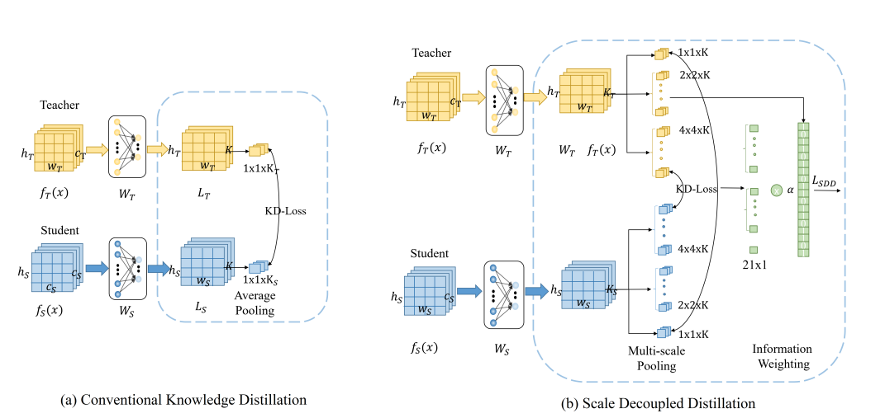

# SDD-CVPR204
Official  code for cvpr2024 paper [Scale Decoupled Distillation](https://arxiv.org/pdf/2403.13512.pdf)


# Framework


# Installation

Environments:

- Python 3.8
- PyTorch 1.12.0
- torchvision 0.13.1


Core code
- We provide the implement of SD-KD ,SD-DKD, and SD-NKD in [KD.py](mdistiller%2Fdistillers%2FKD.py), [SDD_DKD.py](mdistiller%2Fdistillers%2FSDD_DKD.py), and [SDD_nkd.py](mdistiller%2Fdistillers%2FSDD_nkd.py)


Training on CIFAR-100

- Fetch the pretrained teacher models by:
    ```angular2html
    sh fetch_pretrained_teachers.sh
    ```
  which will download and save the models to save/models

- Run distillation by following commands in [teacher_resnet32x4.sh](teacher_resnet32x4.sh),[teacher_unpair.sh](teacher_unpair.sh),[teacher_vgg.sh](teacher_vgg.sh), and [teacher_wrn.sh](teacher_wrn.sh). An example of is given by
  ```bash
  python train_origin.py --cfg configs/cifar100/sdd_dkd/res32x4_shuv1.yaml --gpu 1 --M [1,2,4]
  ```


# Acknowledgement
Thanks for CRD and DKD. We build this library based on the [CRD's codebase](https://github.com/HobbitLong/RepDistiller) and the [DKD's codebase](https://github.com/megvii-research/mdistiller)