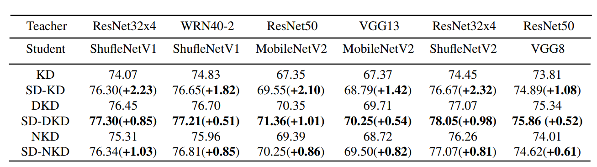
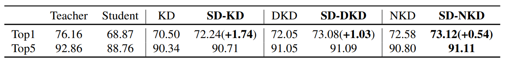
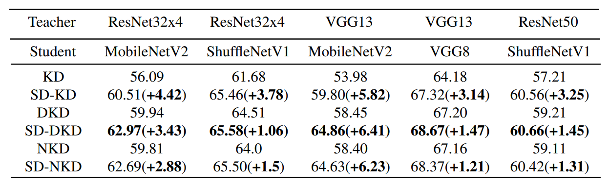

# SDD-CVPR204
Official  code for cvpr2024 paper [Scale Decoupled Distillation](https://arxiv.org/pdf/2403.13512.pdf)


# Introduction

### Framework


### Main result

On CIFAR100


On ImageNet


On CUB200



# Installation

Environments:

- Python 3.8
- PyTorch 1.12.0
- torchvision 0.13.1


Training on CIFAR-100

- Fetch the pretrained teacher models by:
    ```angular2html
    sh fetch_pretrained_teachers.sh
    ```
  which will download and save the models to save/models

- Run distillation by following commands in [teacher_resnet32x4.sh](teacher_resnet32x4.sh),[teacher_unpair.sh](teacher_unpair.sh),[teacher_vgg.sh](teacher_vgg.sh), and [teacher_wrn.sh](teacher_wrn.sh). An example of is given by
  ```bash
  python train_origin.py --cfg configs/cifar100/sdd_dkd/res32x4_shuv1.yaml --gpu 1 --M [1,2,4]
  ```

Training on ImageNet

- Download the dataset at https://image-net.org/ and put them to ./data/imagenet **or** if you have download it in your computer, build sotf link to ./data/imagenet.
- run the commend in run.sh. For example,
  ```bash
  python -m torch.distributed.launch --nproc_per_node=2 train.py --cfg ./configs/imagenet/r34_r18/sdd_dkd.yaml
  ```

Training on CUB200
- Download the pretrained teacher model in the cub200 folder in [baiduyun](https://pan.baidu.com/s/1uxyG3ZZO67i_dbXwuFB2yQ?pwd=bzc6)
- Mv the 'cub200' folder into the 'save' folder
- Run the command in train_cub_x.sh

Core code
- We provide the implement of SD-KD ,SD-DKD, and SD-NKD in [KD.py](mdistiller%2Fdistillers%2FKD.py), [SDD_DKD.py](mdistiller%2Fdistillers%2FSDD_DKD.py), and [SDD_nkd.py](mdistiller%2Fdistillers%2FSDD_nkd.py)
- We also provide the modified teacher and studnet in [models](mdistiller%2Fmodels), with the suffix of SDD

# Applied SDD into a new teacher-student pair and logit distillation

- modified the teacher and student
  - add the SPP module in the teacher and student model,for example the line 128 in mdistiller/cifar100/resnet.py
  ```bash
  self.spp=SPP(M=M)              
  ```
  - and then calculate the scaled decoupled logit output with the final feature maps before pooling. For example the line202-209 in mdistiller/cifar100/resnet.py
      
  ```python
        x_spp,x_strength = self.spp(x)

        x_spp = x_spp.permute((2, 0, 1))
        m, b, c = x_spp.shape[0], x_spp.shape[1], x_spp.shape[2]
        x_spp = torch.reshape(x_spp, (m * b, c))
        patch_score = self.fc(x_spp)
        patch_score = torch.reshape(patch_score, (m, b, self.class_num))
        patch_score = patch_score.permute((1, 2, 0))
    ```
- modified logit distillation
  - convert shape
    - from B X C X N to N*B X C. Here N is the number of decoupled region
  - calculate the distillation loss with vanilla distillation loss
    - only conduct average or sum in the dim of calss and skip the dim of batch
  - find the complementary and consistent local distillation loss and modify the weight of complementary terms
  - example can see the sdd_kd_loss in [KD.py](mdistiller%2Fdistillers%2FKD.py)

# Acknowledgement
Thanks for CRD and DKD. We build this library based on the [CRD's codebase](https://github.com/HobbitLong/RepDistiller) and the [DKD's codebase](https://github.com/megvii-research/mdistiller)